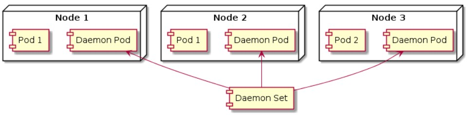

# ⚙️ DaemonSet

**DaemonSet** adalah controller di Kubernetes yang memastikan **satu pod dijalankan di setiap node** (atau pada node tertentu).



# 📦 CREATE DAEMON SET
```
lab@SRV-1:~$ nano daemon-set.yml
lab@SRV-1:~$ kubectl create -f daemonset.yml
daemonset.apps/daemon-set created
lab@SRV-1:~$ kubectl get ds
NAME         DESIRED   CURRENT   READY   UP-TO-DATE   AVAILABLE   NODE SELECTOR   AGE
daemon-set   1         1         1       1            1           <none>          114s
lab@SRV-1:~$ kubectl get po
NAME               READY   STATUS    RESTARTS   AGE
daemon-set-fr84z   1/1     Running   0          17s
```