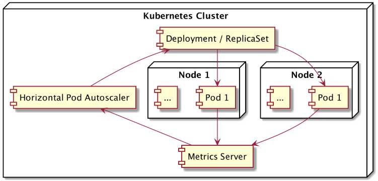

# Auto Scaler di Kubernetes

Kubernetes menyediakan mekanisme **scaling** untuk menyesuaikan jumlah atau kapasitas pod sesuai kebutuhan aplikasi.

---

## 1️⃣ Vertical Scaling
- **Definisi:** Meningkatkan kapasitas sumber daya (**CPU, Memory**) pod yang sudah ada.  
- **Contoh:**  
  - Sebelumnya pod menggunakan `CPU: 1` → di-upgrade menjadi `CPU: 2`.

---

## 2️⃣ Horizontal Scaling
- **Definisi:** Menambah jumlah pod baru untuk menangani beban kerja lebih banyak.  
- **Contoh:**  
  - Awalnya ada 2 pod → ditambah menjadi 5 pod saat traffic tinggi.

---

## 3️⃣ Horizontal Pod Autoscaler (HPA)
- **Fungsi:** Menyediakan kemampuan **horizontal scaling otomatis**.  
- **Cara kerja:**  
  1. HPA memantau **metrics** (CPU, memory, custom metrics).  
  2. Jika metric melewati threshold tertentu → HPA menambah pod baru.  
  3. Jika metric turun → HPA mengurangi jumlah pod.  



- **Contoh Konfigurasi HPA:**
sebelumnya kita perlu enable matrics
```
lab@SRV-1:~$ minikube addons enable metrics-server
💡  metrics-server is an addon maintained by Kubernetes. For any concerns contact minikube on GitHub.
You can view the list of minikube maintainers at: https://github.com/kubernetes/minikube/blob/master/OWNERS
    ▪ Using image registry.k8s.io/metrics-server/metrics-server:v0.8.0
🌟  The 'metrics-server' addon is enabled
lab@SRV-1:~$ kubectl get all --namespace kube-system
NAME                                   READY   STATUS    RESTARTS       AGE
pod/coredns-66bc5c9577-c5nj5           1/1     Running   2 (168m ago)   3d23h
pod/coredns-66bc5c9577-lzb5s           1/1     Running   2 (168m ago)   3d23h
pod/etcd-minikube                      1/1     Running   5 (168m ago)   6d4h
pod/kube-apiserver-minikube            1/1     Running   5 (168m ago)   6d4h
pod/kube-controller-manager-minikube   1/1     Running   5 (168m ago)   6d4h
pod/kube-proxy-ftkz7                   1/1     Running   5 (168m ago)   6d4h
pod/kube-scheduler-minikube            1/1     Running   5 (168m ago)   6d4h
pod/metrics-server-85b7d694d7-qpgqh    1/1     Running   0              93s
pod/storage-provisioner                1/1     Running   3 (167m ago)   3d4h

NAME                     TYPE        CLUSTER-IP     EXTERNAL-IP   PORT(S)                  AGE
service/kube-dns         ClusterIP   10.96.0.10     <none>        53/UDP,53/TCP,9153/TCP   6d4h
service/metrics-server   ClusterIP   10.110.64.72   <none>        443/TCP                  93s
```
apabila sudah terenable maka bisa konfigurasi HPA
```
lab@SRV-1:~$ nano hpa.yml
lab@SRV-1:~$ kubectl create -f hpa.yml
deployment.apps/nodejs-web created
service/nodejs-nodeport created
horizontalpodautoscaler.autoscaling/hpa-name created
lab@SRV-1:~$ kubectl get all
NAME                              READY   STATUS    RESTARTS   AGE
pod/nodejs-web-7f6c7cd89d-wn54h   1/1     Running   0          4s

NAME                      TYPE        CLUSTER-IP       EXTERNAL-IP   PORT(S)          AGE
service/kubernetes        ClusterIP   10.96.0.1        <none>        443/TCP          34s
service/nodejs-nodeport   NodePort    10.107.141.249   <none>        3000:30001/TCP   4s

NAME                         READY   UP-TO-DATE   AVAILABLE   AGE
deployment.apps/nodejs-web   1/1     1            1           4s

NAME                                    DESIRED   CURRENT   READY   AGE
replicaset.apps/nodejs-web-7f6c7cd89d   1         1         1       4s

NAME                                           REFERENCE               TARGETS                                     MINPODS   MAXPODS   REPLICAS   AGE
horizontalpodautoscaler.autoscaling/hpa-name   Deployment/nodejs-web   cpu: <unknown>/50%, memory: <unknown>/50%   2         5         0          4s
```
nah disini masih 1 pod yang terbuat lalu HPA akan memberikan trigger bahwa minimal podnya adalah 2, setelah itu ada pod baru yang terbuat sesuai trigger HPA
```
lab@SRV-1:~$ kubectl get all
NAME                              READY   STATUS    RESTARTS   AGE
pod/nodejs-web-7f6c7cd89d-ln7kf   1/1     Running   0          11s
pod/nodejs-web-7f6c7cd89d-wn54h   1/1     Running   0          26s

NAME                      TYPE        CLUSTER-IP       EXTERNAL-IP   PORT(S)          AGE
service/kubernetes        ClusterIP   10.96.0.1        <none>        443/TCP          56s
service/nodejs-nodeport   NodePort    10.107.141.249   <none>        3000:30001/TCP   26s

NAME                         READY   UP-TO-DATE   AVAILABLE   AGE
deployment.apps/nodejs-web   2/2     2            2           26s

NAME                                    DESIRED   CURRENT   READY   AGE
replicaset.apps/nodejs-web-7f6c7cd89d   2         2         2       26s

NAME                                           REFERENCE               TARGETS                                     MINPODS   MAXPODS   REPLICAS   AGE
horizontalpodautoscaler.autoscaling/hpa-name   Deployment/nodejs-web   cpu: <unknown>/50%, memory: <unknown>/50%   2         5         1          26s
```