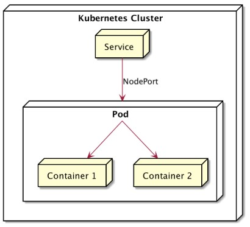

# 🌐 MultiContainer POD - Kubernetes

## 📘 Deskripsi
Saat menggunakan **docker** biasanya **1 container** digunakan untuk **1 aplikasi**. nah di **Kubernetes** berbeda **1 pod** bisa terdapat **beberapa container**. container container itu dapat berbegi resource (network & storage) dan saling bantu menjalankan fungsinya



# ⚙️ Konfigurasi
Disini saya akan membuat manifest dimana akan membuat 2 container (nodeja & nginx) pada 1 pod
```
lab@SRV-1:~$ nano multi-container.yml
lab@SRV-1:~$ kubectl create -f multi-container.yml
lab@SRV-1:~$ kubectl get all
NAME                   READY   STATUS    RESTARTS   AGE
pod/curl               1/1     Running   0          19s
pod/replicasrt-d5gdx   2/2     Running   0          19s
pod/replicasrt-nxksm   2/2     Running   0          19s

NAME                 TYPE        CLUSTER-IP      EXTERNAL-IP   PORT(S)             AGE
service/kubernetes   ClusterIP   10.96.0.1       <none>        443/TCP             54s
service/service      ClusterIP   10.97.141.196   <none>        8080/TCP,3000/TCP   19s

NAME                         DESIRED   CURRENT   READY   AGE
replicaset.apps/replicasrt   2         2         2       19s
```
Untuk pengujian disini kita akan masuk ke pod curl
```
lab@SRV-1:~$ kubectl exec -it curl -- /bin/sh
/ # curl http://10.97.141.196:8080
<!DOCTYPE html>
<html>
<head>
<title>Welcome to nginx!</title>
<style>
html { color-scheme: light dark; }
body { width: 35em; margin: 0 auto;
font-family: Tahoma, Verdana, Arial, sans-serif; }
</style>
</head>
<body>
<h1>Welcome to nginx!</h1>
<p>If you see this page, the nginx web server is successfully installed and
working. Further configuration is required.</p>

<p>For online documentation and support please refer to
<a href="http://nginx.org/">nginx.org</a>.<br/>
Commercial support is available at
<a href="http://nginx.com/">nginx.com</a>.</p>

<p><em>Thank you for using nginx.</em></p>
</body>
</html>
```
disini apabila akses port 3000 akan diarahkan ke container nodejs
```
/ # curl http://10.97.141.196:3000
Hello World
```

# 🧠 NOTES
```
lab@SRV-1:~$ kubectl get po
NAME               READY   STATUS    RESTARTS   AGE
curl               1/1     Running   0          103s
replicasrt-d5gdx   2/2     Running   0          103s
replicasrt-nxksm   2/2     Running   0          103s 
```
diatas terdapat 3 pod, curl lalu 2 replica. didalam 1 replica terdapat 2 container yaitu container nginx & nodejs. bukan 1 replika terdiri dari 2 nginx dan 1 replica lagi terdiri dari 2 nodejs. 
