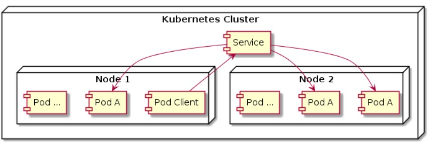

# 🌐 Service - Kubernetes

## 📘 Deskripsi
**Service** adalah resource di Kubernetes yang digunakan untuk membuat **satu gerbang akses (gateway)** ke satu atau lebih **Pod**.  
Service memiliki **IP dan port yang tetap** selama service tersebut ada, sehingga client tidak perlu tahu IP pod secara langsung.

Client akan mengakses **IP service**, lalu service akan meneruskan traffic tersebut ke pod-pod yang terhubung di belakangnya.



---

## ⚙️ Fungsi Utama
- Menghubungkan **pod ke pod lain** dalam satu cluster  
- **Mendistribusikan traffic secara seimbang** ke beberapa pod  
- Menggunakan **label selector** untuk menentukan pod mana yang menjadi target service  

---

## 🧩 Contoh Kasus

```
lab@SRV-1:~$ nano service-nginx.yml
lab@SRV-1:~$ kubectl create -f service-nginx.yml
lab@SRV-1:~$ kubectl get all
NAME                    READY   STATUS    RESTARTS   AGE
pod/curl                1/1     Running   0          33s
pod/replication-285t5   1/1     Running   0          33s
pod/replication-4vtpf   1/1     Running   0          33s
pod/replication-x67sp   1/1     Running   0          33s

NAME                    TYPE        CLUSTER-IP     EXTERNAL-IP   PORT(S)    AGE
service/kubernetes      ClusterIP   10.96.0.1      <none>        443/TCP    35s
service/nginx-service   ClusterIP   10.108.21.93   <none>        8080/TCP   33s

NAME                          DESIRED   CURRENT   READY   AGE
replicaset.apps/replication   3         3         3       33s
lab@SRV-1:~$ kubectl exec -it curl -- /bin/bash
/ # curl http://10.108.21.93:8080
```

ip terlihat saat memasukkan perintah ```kubectl get all``` maka ada ClusterIP pada service. namun selain itu juga bisa menggunakan
- env
- DNS
berikut langkah langkahnya

```
lab@SRV-1:~$ kubectl exec -it curl -- /bin/sh
/ # env | grep NGINX_SERVICE
NGINX_SERVICE_PORT_8080_TCP_ADDR=10.108.21.93
NGINX_SERVICE_SERVICE_HOST=10.108.21.93
NGINX_SERVICE_PORT_8080_TCP_PORT=8080
NGINX_SERVICE_PORT_8080_TCP_PROTO=tcp
NGINX_SERVICE_SERVICE_PORT=8080
NGINX_SERVICE_PORT=tcp://10.108.21.93:8080
NGINX_SERVICE_PORT_8080_TCP=tcp://10.108.21.93:8080
/ # curl http://10.108.21.93:8080
```

apabila menggunakan DNS maka formatnnya adalah ```namaservice.namespace.scv.cluster.local:port ``` <br>
/ # curl http://nginx-service.default.svc.cluster.local:8080

## ⚙️ Endpoint
Endpoint adalah resource Kubernetes yang menyimpan IP dan port pod yang terhubung ke serbuah service

Untuk melihat pod dengan perintah berikut
```
lab@SRV-1:~$ kubectl get endpoints
Warning: v1 Endpoints is deprecated in v1.33+; use discovery.k8s.io/v1 EndpointSlice
NAME            ENDPOINTS                                         AGE
kubernetes      192.168.76.2:8443                                 15m
nginx-service   10.244.0.138:80,10.244.0.140:80,10.244.0.141:80   15m
```
