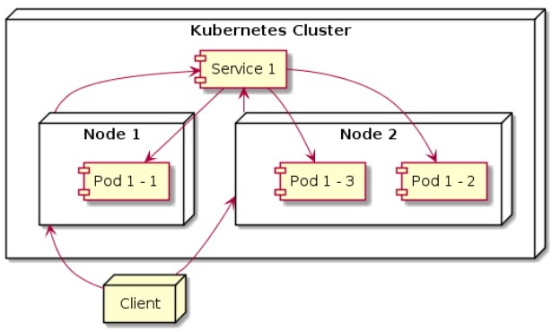

# 🚪 Expose Service di Kubernetes

---

## ⚙️ Daftar Isi
1. [NodePort](#-node-port)
2. [LoadBalancer](#️-loadbalancer)
3. [Ingress](#-ingress)

---

## 🧱 NODE PORT
## 📘 Deskripsi
**NodePort** adalah tipe *Service* di Kubernetes yang digunakan untuk **mengakses aplikasi di dalam cluster melalui IP node dan port tertentu dari luar cluster**.  
Dengan NodePort, Kubernetes akan **mengekspose port di setiap Node** dalam cluster, sehingga permintaan dari luar bisa diarahkan ke pod di belakang service tersebut.



---

## 🧩 Konsep Dasar
Alur aksesnya seperti ini:
```
Client → Node IP:Node Port → Service → pod 
```

🧠 Jadi, ketika pengguna mengakses `<IP Node>:<NodePort>`, request akan diarahkan ke service yang bersangkutan, lalu diteruskan lagi ke pod yang cocok dengan selector service.

## 🧱 Contoh NodePort
```
lab@SRV-1:~$ nano node-port.yml
lab@SRV-1:~$ kubectl create -f node-port.yml
lab@SRV-1:~$ kubectl get all
NAME              READY   STATUS    RESTARTS   AGE
pod/nginx-hv2qz   1/1     Running   0          14m
pod/nginx-rtmqz   1/1     Running   0          14m
pod/nginx-tvwkt   1/1     Running   0          14m

NAME                          DESIRED   CURRENT   READY   AGE
replicationcontroller/nginx   3         3         3       14m

NAME                 TYPE        CLUSTER-IP      EXTERNAL-IP   PORT(S)        AGE
service/kubernetes   ClusterIP   10.96.0.1       <none>        443/TCP        14m
service/nodeport     NodePort    10.100.96.228   <none>        80:30001/TCP   14m
```

Untuk melihat ip node masukkan perintah ```bash <nodes> service <nama service>```
```
lab@SRV-1:~$ minikube service nodeport
┌───────────┬──────────┬─────────────┬───────────────────────────┐
│ NAMESPACE │   NAME   │ TARGET PORT │            URL            │
├───────────┼──────────┼─────────────┼───────────────────────────┤
│ default   │ nodeport │ 80          │ http://192.168.76.2:30001 │
└───────────┴──────────┴─────────────┴───────────────────────────┘
🎉  Opening service default/nodeport in default browser...
👉  http://192.168.76.2:30001
```


## ⚖️ LOADBALANCER
## 📘 Deskripsi
**LoadBalancer** adalah tipe *Service* di Kubernetes yang digunakan untuk **menyediakan akses dari luar cluster (eksternal)** dengan bantuan **load balancer bawaan dari cloud provider** seperti AWS, GCP, Azure, atau platform lain yang mendukungnya.

LoadBalancer bekerja dengan **membuat IP publik** atau **endpoint eksternal**, yang secara otomatis meneruskan trafik ke NodePort dan kemudian ke Service di dalam cluster.


---

## 🧩 Konsep Dasar
Alur aksesnya seperti ini:
```
Client → Load balancer → Node → Service → pod 
```

🧠 Jadi, Kubernetes akan meminta cloud provider untuk membuat sebuah load balancer eksternal yang mengarahkan trafik ke **NodePort service** di cluster.

## 🧱 Contoh LoadBalancer
pada file manifest kita tidak perlu menentukan target port dan node port karena akan dibuatkan otomatis oleh load balancer
```
lab@SRV-1:~$ nano loadbalancer.yml
lab@SRV-1:~$ kubectl create -f loadbalancer.yml
lab@SRV-1:~$ kubectl get all
lab@SRV-1:~$ kubectl get all
NAME              READY   STATUS    RESTARTS   AGE
pod/nginx-lshsd   1/1     Running   0          12s
pod/nginx-pdlb2   1/1     Running   0          12s
pod/nginx-vddft   1/1     Running   0          12s

NAME                          DESIRED   CURRENT   READY   AGE
replicationcontroller/nginx   3         3         3       12s

NAME                  TYPE           CLUSTER-IP       EXTERNAL-IP   PORT(S)        AGE
service/kubernetes    ClusterIP      10.96.0.1        <none>        443/TCP        29s
service/loadbalance   LoadBalancer   10.107.243.235   <pending>     80:31436/TCP   12s
lab@SRV-1:~$ minikube service loadbalance
┌───────────┬─────────────┬─────────────┬───────────────────────────┐
│ NAMESPACE │    NAME     │ TARGET PORT │            URL            │
├───────────┼─────────────┼─────────────┼───────────────────────────┤
│ default   │ loadbalance │ 80          │ http://192.168.76.2:31436 │
└───────────┴─────────────┴─────────────┴───────────────────────────┘
🎉  Opening service default/loadbalance in default browser...
👉  http://192.168.76.2:31436
```


## 🌐 INGRESS
## 📘 Deskripsi
**Ingress** adalah *komponen Kubernetes* yang berfungsi untuk **mengatur akses HTTP/HTTPS dari luar cluster** ke berbagai *Service* di dalam cluster.  

Kalau *Service* seperti `LoadBalancer` atau `NodePort` membuka satu port ke satu service saja,  
maka **Ingress memungkinkan satu pintu (domain/IP)** melayani **banyak aplikasi sekaligus** dengan aturan *routing* tertentu.


---

## 🧩 Ilustrasi Konsep
```
Client → Ingress Controller → Node → Service → pod 
```

Ingress bekerja bersama **Ingress Controller** — yaitu komponen yang benar-benar menangani trafik HTTP (misalnya Nginx Ingress Controller).  
Ingress Controller membaca aturan pada resource `Ingress` dan mengarahkan trafik sesuai *path* atau *host/domain*.

---

## ⚙️ Komponen Utama

| Komponen               | Fungsi                                                             |
|------------------------|--------------------------------------------------------------------|
| **Ingress Resource**   | Mendefinisikan aturan routing (host, path, service tujuan).        |
| **Ingress Controller** | Komponen yang menerapkan aturan tersebut (contoh: NGINX, Traefik). |
| **Service & Pod**      | Aplikasi tujuan di dalam cluster.                                  |

## 🧱 Contoh Ingress
disini saya memiliki 2 service yaitu **service-nginx-backend** & **service-nginx-frontend**. nanti apabila mengakses domain ingress maka akan diarahkan ke frontend. dan jika diberikan /api maka akan diarahkan ke service backend 
```
lab@SRV-1:~$ kubectl create -f ingress.yml
replicationcontroller/rc-frontend created
service/service-nginx-frontend created
replicationcontroller/rc-backend created
service/service-nginx-backend created
ingress.networking.k8s.io/nginx-ingress created
```
untuk melihat resource ingress tuliskan perintah berikut, disini terdapat host sesuai konfigurasi di file manifest. host ini nantinya akan ditambahkan pada /etc/host
```
lab@SRV-1:~$ kubectl get ingress
NAME            CLASS   HOSTS                   ADDRESS   PORTS   AGE
nginx-ingress   nginx   nginx.destiaeka.local             80      10s
lab@SRV-1:~$ kubectl get all
NAME                    READY   STATUS    RESTARTS   AGE
pod/rc-backend-v8s8j    1/1     Running   0          31s
pod/rc-backend-xtglf    1/1     Running   0          31s
pod/rc-backend-z9ghx    1/1     Running   0          31s
pod/rc-frontend-h5gls   1/1     Running   0          31s
pod/rc-frontend-xg95v   1/1     Running   0          31s
pod/rc-frontend-zfvhr   1/1     Running   0          31s

NAME                                DESIRED   CURRENT   READY   AGE
replicationcontroller/rc-backend    3         3         3       31s
replicationcontroller/rc-frontend   3         3         3       31s

NAME                             TYPE        CLUSTER-IP       EXTERNAL-IP   PORT(S)    AGE
service/kubernetes               ClusterIP   10.96.0.1        <none>        443/TCP    54s
service/service-nginx-backend    ClusterIP   10.103.234.235   <none>        8080/TCP   31s
service/service-nginx-frontend   ClusterIP   10.102.33.33     <none>        80/TCP     31s
```
lihat ip minikube dengan perintah berikut
```
lab@SRV-1:~$ minikube ip
192.168.76.2
```
disini tuliskan ip dan host ingress kalian melalui step sebelumnya
```
lab@SRV-1:~$ head -n 5 /etc/hosts
127.0.0.1       localhost
127.0.1.1       SRV-1
192.168.76.2    nginx.destiaeka.local
```

apabila sudah disini pengujian dengan mengakses ingressnya. saat mengakses nginx.destiaeka.local maka akan muncul tampilan default nginx
```
lab@SRV-1:~$ curl nginx.destiaeka.local
<!DOCTYPE html>
<html>
<head>
<title>Welcome to nginx!</title>
<style>
html { color-scheme: light dark; }
body { width: 35em; margin: 0 auto;
font-family: Tahoma, Verdana, Arial, sans-serif; }
</style>
</head>
<body>
<h1>Welcome to nginx!</h1>
<p>If you see this page, the nginx web server is successfully installed and
working. Further configuration is required.</p>

<p>For online documentation and support please refer to
<a href="http://nginx.org/">nginx.org</a>.<br/>
Commercial support is available at
<a href="http://nginx.com/">nginx.com</a>.</p>

<p><em>Thank you for using nginx.</em></p>
</body>
</html>
```

namun saat mengakses nginx.destiaeka.local/api maka akan mengakses service backend. karena pada resource ingress endpoint /api diarahkan ke service backend
```
lab@SRV-1:~$ curl nginx.destiaeka.local/api
This is backend service
```

# 🧩 Kesimpulan
| Komponen         | Akses dari luar         | Mengatur routing | Butuh Cloud Provider | Cocok untuk                      |
| ---------------- | ----------------------- | ---------------- | -------------------- | -------------------------------- |
| **NodePort**     | Ya (manual IP:Port)     | Tidak            | Tidak                | Testing lokal                    |
| **LoadBalancer** | Ya (IP publik otomatis) | Tidak            | Ya                   | Produksi di cloud                |
| **Ingress**      | Ya (via HTTP/HTTPS)     | Ya               | Tidak wajib          | Multi-service dengan satu domain |
