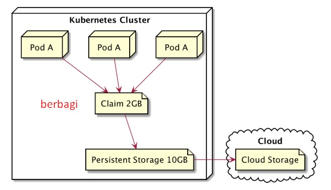
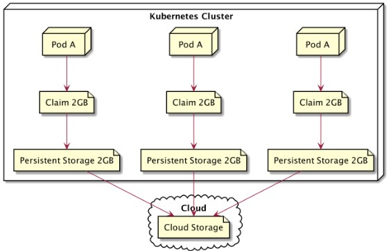

# 🧩 StatefulSet & Stateful Application

## ⚙️ Stateless vs Stateful Application

### 🟢 Stateless Application
Aplikasi **stateless** adalah aplikasi yang **tidak menyimpan data** di dalamnya.  
Kalau pod hilang atau mati, bisa langsung diganti baru karena tidak ada data penting yang perlu disimpan.  
Yang penting, ada penggantinya.

🧠 **Contoh:** web server, API gateway, frontend web (React, Nginx, dll)

---

### 🔵 Stateful Application
Aplikasi **stateful** adalah aplikasi yang **menyimpan data**, contohnya seperti **database**.  
Karena menyimpan data, pod tidak bisa asal diganti seperti stateless — harus tetap menggunakan data lama.

🧠 **Contoh:** MySQL, PostgreSQL, Redis, MongoDB

---

## 💾 Persistent Volume (PV) & Persistent Volume Claim (PVC)

### 🟢 Stateless dengan Persistent Volume
- Stateless app bisa **claim PV yang sama**.  
- Misalnya ada 3 pod dan masing-masing claim 2Gi, maka mereka **berbagi** volume yang sama.
- Ini **tidak masalah**, karena biasanya pod hanya membaca atau menulis data ringan yang tidak saling bertabrakan.

📘 **Contoh Kasus:**  
3 web server menggunakan shared volume untuk menyimpan file gambar.

📦 **Controller yang digunakan:** `Deployment`



---

### 🔵 Stateful dengan Persistent Volume
- Stateful app **tidak bisa menggunakan PV yang sama**.  
- Setiap pod harus punya **PVC sendiri-sendiri**, karena masing-masing menyimpan data unik.  
- Data antar pod tidak boleh bercampur.

📘 **Analogi:**
Bayangkan kamu punya 3 cabang bank:
- `bank1 - Bali`
- `bank2 - Jogja`
- `bank3 - Jatim`

Masing-masing cabang harus punya **brankas sendiri** untuk menyimpan data nasabahnya.  
Tidak bisa tiga cabang bank memakai **satu brankas yang sama**, karena datanya bisa bercampur dan rusak.

📦 **Controller yang digunakan:** `StatefulSet`



---

## 🏦 StatefulSet

**StatefulSet** digunakan untuk **membuat dan memanage aplikasi jenis stateful**.  
Controller ini memastikan:
- Nama pod **konsisten dan berurutan** (misal `mysql-0`, `mysql-1`, `mysql-2`).
- Tiap pod memiliki **PVC sendiri** yang otomatis dibuat.
- Jika pod hilang atau rusak, Kubernetes akan **membuat ulang pod dengan nama dan volume yang sama**.

🧠 **Analogi:**
> Kalau brankas Bank Bali rusak, maka Kubernetes akan membangun ulang **brankas baru dengan nama dan isi yang sama** seperti sebelumnya.

---

## 🧩 Perbandingan

| Fitur | Stateless (Deployment) | Stateful (StatefulSet) |
|-------|------------------------|-------------------------|
| Penyimpanan data | Tidak ada / shared | Tiap pod punya volume sendiri |
| Nama pod | Random | Tetap (berurutan) |
| Penggantian pod | Buat baru bebas | Buat ulang dengan nama & data yang sama |
| Cocok untuk | Web server, frontend, API | Database, cluster service |
| Volume | Bisa sharing PV | PVC terpisah untuk tiap pod |

---

## 📦 Configuration
```
lab@SRV-1:~$ nano statefulset.yml
lab@SRV-1:~$ kubectl create -f statefulset.yml
persistentvolume/pv-sfs created
statefulset.apps/sfs created
lab@SRV-1:~$ kubectl get all
NAME        READY   STATUS    RESTARTS   AGE
pod/sfs-0   1/1     Running   0          13s
pod/sfs-1   1/1     Running   0          9s
pod/sfs-2   1/1     Running   0          4s

NAME                 TYPE        CLUSTER-IP   EXTERNAL-IP   PORT(S)   AGE
service/kubernetes   ClusterIP   10.96.0.1    <none>        443/TCP   4m31s

NAME                   READY   AGE
statefulset.apps/sfs   3/3     13s
```
disini apabila kita lihat persistent volume claim maka akan ada 3 claim untuk masing masing pod
```
lab@SRV-1:~$ kubectl get pvc
NAME               STATUS   VOLUME                                     CAPACITY   ACCESS MODES   STORAGECLASS   VOLUMEATTRIBUTESCLASS   AGE
nodejs-pvc-sfs-0   Bound    pvc-be6f037e-727e-423f-83a7-9074df035b73   1Gi        RWO            standard       <unset>                 2m28s
nodejs-pvc-sfs-1   Bound    pvc-d9ff4919-8bfa-40c3-8d3a-90e71a228df3   1Gi        RWO            standard       <unset>                 2m24s
nodejs-pvc-sfs-2   Bound    pvc-d68c6aa3-7f39-4fb5-88cb-6e5b58d6a5f2   1Gi        RWO            standard       <unset>                 2m19s
```
lalu disini kita akan mencoba menghapus salah 1 pod untuk melihat pod baru yang akan terbuat
```
lab@SRV-1:~$ kubectl delete po sfs-1
pod "sfs-1" deleted from default namespace
lab@SRV-1:~$ kubectl get all
NAME        READY   STATUS    RESTARTS   AGE
pod/sfs-0   1/1     Running   0          10m
pod/sfs-1   1/1     Running   0          10s
pod/sfs-2   1/1     Running   0          9m59s

NAME                 TYPE        CLUSTER-IP   EXTERNAL-IP   PORT(S)   AGE
service/kubernetes   ClusterIP   10.96.0.1    <none>        443/TCP   14m

NAME                   READY   AGE
statefulset.apps/sfs   3/3     10m
```
---

## 📘 Kesimpulan
- Gunakan **Deployment** untuk aplikasi **stateless**.  
- Gunakan **StatefulSet** untuk aplikasi **stateful** yang membutuhkan identitas dan penyimpanan data tetap.  
- Dalam StatefulSet, setiap pod punya **volume (brankas)** sendiri agar data tidak bercampur.

---
