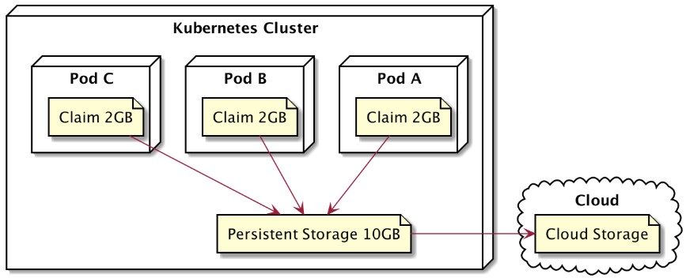

# 🧱 Persistent Volume (PV)

**Persistent Volume (PV)** hampir mirip dengan **volume biasa**, tapi cara kerjanya berbeda.  
Proses pembuatannya memang lebih rumit, namun memiliki beberapa **kelebihan** seperti data yang **tetap tersimpan walaupun Pod dihapus atau direstart**.



---

## ⚙️ Jenis-jenis Persistent Volume

- **HostPath**  
  Disimpan langsung di node lokal.  
  ⚠️ *Tidak direkomendasikan untuk environment production.*

- **GCEPersistentDisk**  
  Penyimpanan persisten milik **Google Cloud Platform (GCP)**.

- **AWSElasticBlockStore (EBS)**  
  Penyimpanan persisten milik **Amazon Web Services (AWS)**.

- **AzureFile**  
  Penyimpanan persisten milik **Microsoft Azure**.

---

## 🪜 Tahapan Penggunaan Persistent Volume

1. **Membuat Persistent Volume (PV)**  
   → Menentukan jenis storage, kapasitas, dan aksesnya.  

2. **Membuat Persistent Volume Claim (PVC)**  
   → Pod akan “meminta” resource storage yang sesuai dengan spesifikasi PV.  

3. **Menambahkan PVC ke Pod**  
   → PVC dikaitkan ke Pod agar data bisa disimpan secara persisten.

---

## ⚙️ Configuration
```
lab@SRV-1:~$ nano persistent-volume.yml
lab@SRV-1:~$ kubectl create -f persistent-volume.yml
persistentvolume/persistent-volume created
persistentvolumeclaim/persistent-volume-claim created
pod/pod-pv created
lab@SRV-1:~$ kubectl get all
NAME         READY   STATUS    RESTARTS   AGE
pod/pod-pv   1/1     Running   0          4s

NAME                 TYPE        CLUSTER-IP   EXTERNAL-IP   PORT(S)   AGE
service/kubernetes   ClusterIP   10.96.0.1    <none>        443/TCP   36s
lab@SRV-1:~$ kubectl exec -it pod-pv -- /bin/sh
 # cat /app/html/index.html
<html><body>Fri Oct 24 2025 08:05:42 GMT+0000 (Coordinated Universal Time)</body></html>
```
---

### 💡 Singkatnya
> - Persistent Volume = Penyimpanan permanen yang dikelola Kubernetes,  
> - tetap ada walau Pod hilang, dan bisa digunakan ulang oleh Pod lain.
> - selain itu bisa menentukan claimnya misalnya untuk pod A 2Gi sehingga tidak ada rebutan
