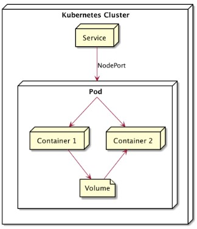

# 📂 Sharing Volume di Kubernetes

## 🧩 Pengertian
**Sharing Volume** adalah mekanisme di Kubernetes di mana beberapa **container dalam satu Pod** dapat menggunakan **volume yang sama**.  
Dengan begitu, container-container tersebut bisa **berbagi data** melalui direktori yang sama di dalam Pod.

Contohnya, satu container membuat file, dan container lain membaca atau memproses file tersebut.



---

## ⚙️ Fungsi
- Memungkinkan **komunikasi antar container** melalui file yang sama.  
- Menyederhanakan **proses berbagi data** antar container dalam satu Pod.  
- Cocok untuk skenario seperti:
  - Container **producer** yang membuat file.
  - Container **consumer** yang membaca atau memproses file tersebut.

---

## 🧱 Contoh Kasus
Misalnya terdapat 2 container dalam satu Pod:
1. **Container nodejs**: menulis data ke `/app/html`
2. **Container nginx**: membaca data dari volume lalu men-serve hasilnya lewat web server `/usr/share/nginx/html`

Keduanya menggunakan volume bernama `sharing`.

---

## 📝 Contoh YAML
```
lab@SRV-1:~$ nano sharingvolumes.yml
lab@SRV-1:~$ kubectl create -f sharingvolumes.yml
lab@SRV-1:~$ kubectl get all
lab@SRV-1:~$ kubectl get all
NAME                      READY   STATUS    RESTARTS   AGE
pod/sharingvolume-5mqp5   2/2     Running   0          95s
pod/sharingvolume-n4scz   2/2     Running   0          95s
pod/sharingvolume-nltr5   2/2     Running   0          95s

NAME                             TYPE        CLUSTER-IP      EXTERNAL-IP   PORT(S)        AGE
service/kubernetes               ClusterIP   10.96.0.1       <none>        443/TCP        94s
service/sharing-volume-service   NodePort    10.101.130.29   <none>        80:30001/TCP   95s

NAME                            DESIRED   CURRENT   READY   AGE
replicaset.apps/sharingvolume   3         3         3       95s
```
nah untuk akses kalian bisa memasukkan perintah ```minikube service sharing-volume-service`` lalu akses url yang tertera
```
lab@SRV-1:~$ minikube service sharing-volume-service
┌───────────┬────────────────────────┬─────────────┬───────────────────────────┐
│ NAMESPACE │          NAME          │ TARGET PORT │            URL            │
├───────────┼────────────────────────┼─────────────┼───────────────────────────┤
│ default   │ sharing-volume-service │ 80          │ http://192.168.76.2:30001 │
└───────────┴────────────────────────┴─────────────┴───────────────────────────┘
🎉  Opening service default/sharing-volume-service in default browser...
👉  http://192.168.76.2:30001
lab@SRV-1:~$ curl http://192.168.76.2:30001
<html><body>Thu Oct 23 2025 07:05:55 GMT+0000 (Coordinated Universal Time)</body></html>
```
